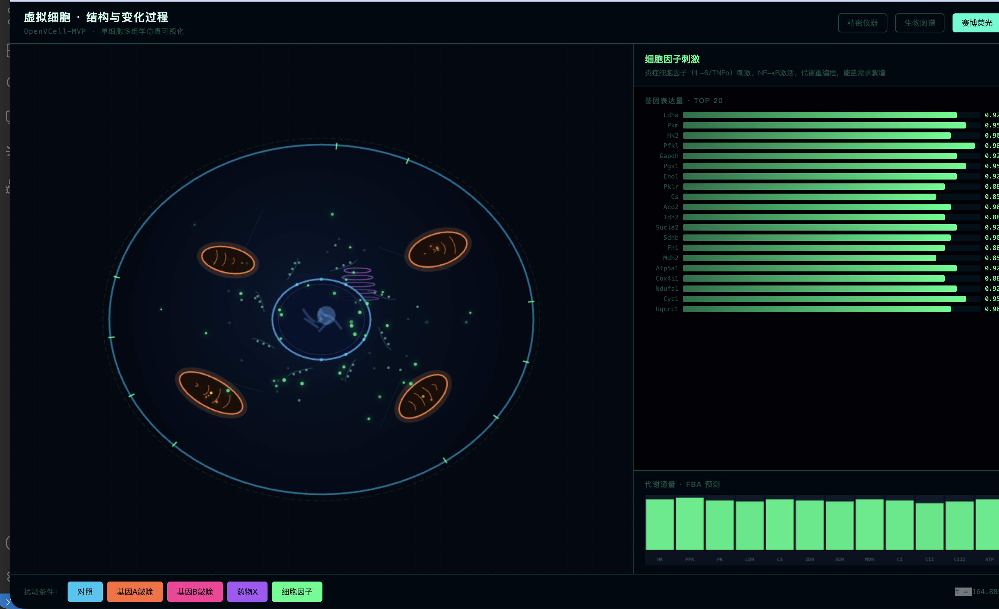

Hello Virtul Cell 




# OpenVCell-MVP 🧬

> **Virtual Cell 研究计划的最小可执行 Demo**
> 用最少的代码贯通"研究计划"中四个阶段的完整流程：
> **数据 → 表征 → 扰动预测 → 机理耦合 → 可视化**。

本 MVP 不追求 SOTA，而是给出一条**可一键运行的 pipeline 骨架**，所有代码 < 1500 行，
CPU + 8GB 内存即可跑通（不需要 GPU、不需要下载海量数据）。后续每个模块都可以
被替换成真正的 SOTA 模型（scGPT / GEARS / CellOT / cobrapy 等）而不破坏整体框架。

---

## 0. 一键体验

```bash
# 1) 进入项目
cd /Users/mac/code/HelloVirtulCell

# 2) 创建虚拟环境并安装依赖（约 2 分钟）
make setup

# 3) 跑通完整流程（约 1-3 分钟）
make all

# 4) 启动交互式虚拟细胞 Demo（浏览器自动打开）
make app
```

或者不用 make：

```bash
python -m venv .venv && source .venv/bin/activate
pip install -r requirements.txt
python -m openvcell.pipeline      # 跑完 4 阶段
streamlit run openvcell/app.py    # 启动 demo
```

---

## 1. 项目结构

```
HelloVirtulCell/
├── research_plan.md            # 完整研究计划 (上一步生成)
├── README.md                   # 本文件
├── requirements.txt
├── Makefile
├── openvcell/
│   ├── __init__.py
│   ├── config.py               # 全局配置
│   ├── stage1_data.py          # Stage 1: 数据底座 (合成 / 真实数据加载)
│   ├── stage2_foundation.py    # Stage 2: 单细胞基础模型 (mini-Transformer)
│   ├── stage3_perturb.py       # Stage 3: 扰动响应预测 (CPA-lite)
│   ├── stage4_mechanism.py     # Stage 4: 机理耦合 (toy FBA + 通路一致性)
│   ├── evaluate.py             # 评估指标
│   ├── pipeline.py             # 串联所有阶段的入口
│   └── app.py                  # Streamlit 交互 demo
├── tests/
│   └── test_pipeline.py        # 烟雾测试
└── artifacts/                  # 自动生成: 数据、模型、图表
```

---

## 2. 各阶段做了什么

| 阶段 | 模块 | 做了什么（MVP 实现） | 真实研究里替换为 |
|---|---|---|---|
| Stage 1 | `stage1_data.py` | 生成 / 加载 `AnnData`：2000 cells × 200 genes，含 3 种 cell type、5 种扰动；自动 QC + log-normalize | CELLxGENE Census / scPerturb |
| Stage 2 | `stage2_foundation.py` | 一个 4 层 Transformer encoder，对 (gene, expr) 序列做 masked-expression 重建，输出 cell embedding | scGPT / Geneformer / UCE |
| Stage 3 | `stage3_perturb.py` | CPA-lite：cell embedding + 扰动 one-hot → MLP → ΔExpression；leave-perturb-out 评估 | CPA / GEARS / CellOT / Flow Matching |
| Stage 4 | `stage4_mechanism.py` | Toy FBA：把预测表达映射到酶丰度，用 `scipy.optimize.linprog` 求最大生物量通量；与 KEGG-style 通路 prior 算一致性 | cobrapy + Human-GEM + tellurium |
| 评估 | `evaluate.py` | Pearson Δ、Top-K DEG 召回、cell-type macro-F1、通路一致性 | Open Problems / PerturBench / scIB |
| Demo | `app.py` | Streamlit：选 cell type + 扰动 → 输出预测表达、UMAP、代谢通量、通路富集 | 同款，可换真模型 |

---

## 3. 真实数据接入（可选）

默认使用合成数据，方便首次跑通。要切换到真实数据，把 `config.py` 中：

```python
USE_REAL_DATA = False
```

改为 `True` 后，`stage1_data.py` 会用 `cellxgene-census` 拉取 ~5k 真实人 PBMC 单细胞
（约 50MB，需联网），其余阶段无需改动。

---

## 4. 评估输出

跑完 `make all` 后，`artifacts/report.md` 会包含：
- 数据 QC 指标
- 基础模型重建 loss 曲线
- 扰动预测 Pearson / Top-20 DEG recall
- 代谢通量预测 vs ground truth 的 R²
- UMAP 可视化（对照 vs 扰动）

---

## 5. 与研究计划的对应

```
research_plan.md   ──►  本 MVP 的可执行版本
  Stage 1 数据底座   ──►  openvcell/stage1_data.py
  Stage 2 基础模型   ──►  openvcell/stage2_foundation.py
  Stage 3 扰动预测   ──►  openvcell/stage3_perturb.py
  Stage 4 多尺度耦合 ──►  openvcell/stage4_mechanism.py
  评估基准           ──►  openvcell/evaluate.py
  交互 demo          ──►  openvcell/app.py
```

每个文件顶部都有 `# TODO: replace with <真实工具>` 注释，标明在真实研究中应该替换成哪个 SOTA。

---

## 6. 下一步路线

1. 把 `stage1_data.py` 替换为 `cellxgene-census` + `scvi-tools` 真实流水线。
2. 把 `stage2_foundation.py` 升级为 scGPT/Geneformer 官方权重 + LoRA 微调。
3. 把 `stage3_perturb.py` 升级为 GEARS 或自研 Flow Matching。
4. 把 `stage4_mechanism.py` 接入 `cobrapy` + Human-GEM。
5. 加入 Cell Painting 形态分支（`cellprofiler` 特征 → CLIP 对齐）。

> 这就是把"hello world"的虚拟细胞，逐步演化成真正 OpenVCell-v0.1 的路径。
