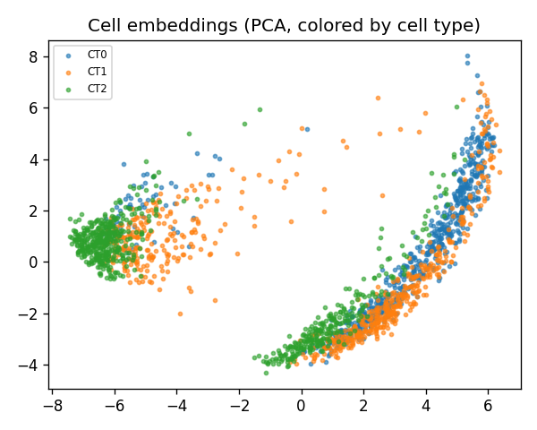
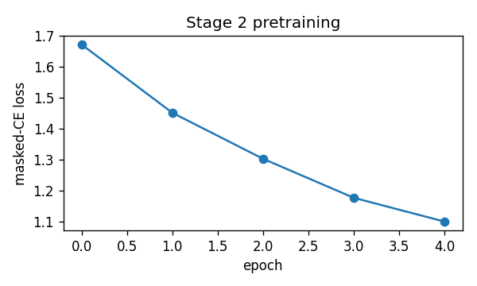
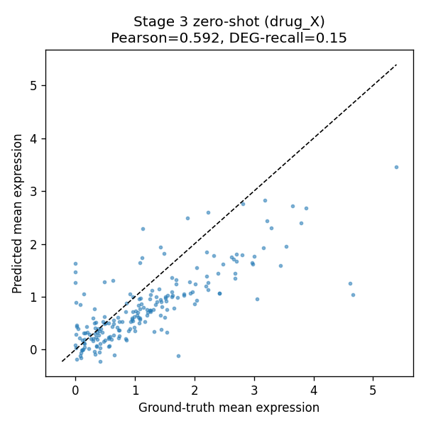
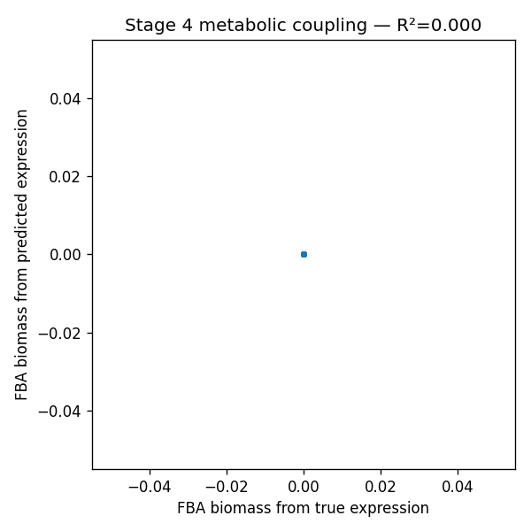

# OpenVCell-MVP — Run Report

## Data (Stage 1)
- cells: **2000**, genes: **200**
- cell types: 3, perturbations: 5
- median counts/cell: 1435.0

## Foundation model (Stage 2)
- final masked-CE loss: **1.100**
- cell-type macro-F1 from embeddings: **0.998**
- 
- 

## Perturbation prediction (Stage 3, leave-perturb-out)
- held-out perturbation: **drug_X**
- per-gene Pearson  : **0.592**
- Top-20 DEG recall : **0.150**
- 

## Mechanism coupling (Stage 4)
- biomass R² (pred vs truth): **0.000**
- pathway co-direction score: **0.812**
- 

---
Run `streamlit run openvcell/app.py` to launch the interactive demo.
